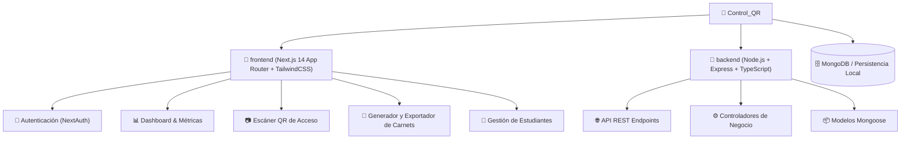
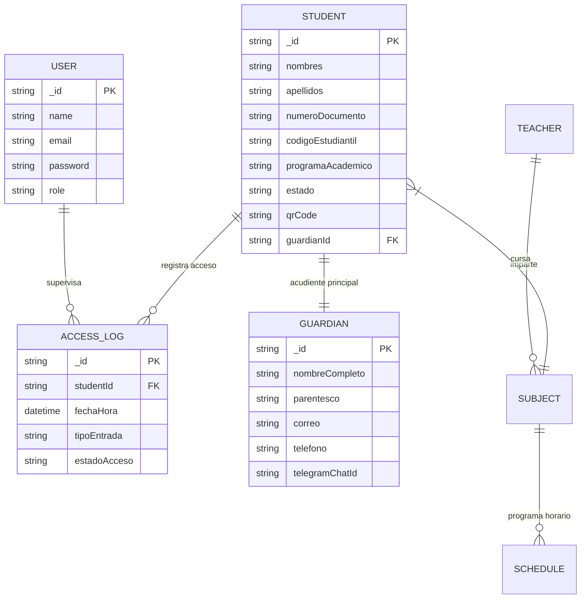

# 🎓 ControlQR — Sistema de Control de Ingreso y Carnetización Estudiantil

<div align="center">


**Solución web integral para la gestión, emisión de carnets digitales y control de acceso en tiempo real de estudiantes en instituciones educativas.**

[🚀 Características](#-características-principales) • [🏗️ Arquitectura](#️-arquitectura-del-sistema) • [💻 Instalación](#-instalación-y-ejecución-local) • [🔑 Credenciales](#-credenciales-de-acceso-por-defecto) • [📱 Módulos](#-módulos-del-sistema)

</div>

---

## 📌 Resumen del Proyecto

**ControlQR** automatiza el registro de ingresos y salidas de los estudiantes mediante la lectura de códigos QR inteligentes generados e integrados en carnets estudiantiles (impresos o digitales). 

El sistema cuenta con un panel administrativo de métricas en tiempo real (KPIs), módulo de notificaciones instantáneas para acudientes/guardianes, generador y personalizador de carnets escolares en alta resolución (PDF / PNG), y gestión académica integral de matrículas, cursos y docentes.

---

## ✨ Características Principales

- 📷 **Escáner QR en Tiempo Real:** Compatible con cámaras web, smartphones o lectores de códigos de barras/QR físicos.
- 🎴 **Generador de Carnets Escolares:** Diseño personalizable con preview en vivo, exportación individual y por lotes en formatos PDF, PNG y JPG.
- ⚡ **Notificaciones a Acudientes:** Registro inmediato con fecha/hora y canal de alerta a tutores (Telegram / Email).
- 📊 **Panel de Control & Métricas (KPIs):** Estadísticas en vivo de aforo, ingresos puntuales, retardos y ausencias.
- 👥 **Gestión Completa de Estudiantes y Acudientes:** CRUD intuitivo con búsqueda rápida, filtros y vinculación familiar.
- 📚 **Gestión Académica:** Registro de grados, asignaturas, horarios y docentes encargados.
- 🔐 **Autenticación Segura:** Sesiones protegidas mediante NextAuth.js y control de roles.

---

## 🏗️ Arquitectura del Sistema



---

## 🗄️ Modelo de Datos (Diagrama ER)



---

## 🛠️ Tecnologías Utilizadas

| Capa | Tecnologías |
| :--- | :--- |
| **Frontend** | [Next.js 14](https://nextjs.org/) (App Router), [React](https://react.dev/), [TypeScript](https://www.typescriptlang.org/), [TailwindCSS](https://tailwindcss.com/), [Lucide React](https://lucide.dev/) |
| **Backend** | [Node.js](https://nodejs.org/), [Express](https://expressjs.com/), [TypeScript](https://www.typescriptlang.org/) |
| **Base de Datos** | [MongoDB](https://www.mongodb.com/) con Mongoose ODM |
| **Librerías Clave** | `html-to-image`, `jspdf`, `qrcode`, `bcryptjs`, `next-auth` |

---

## 🚀 Instalación y Ejecución Local

### Prerrequisitos
- Node.js (versión 18 o superior)
- npm o yarn
- Instancia de MongoDB local o URI de MongoDB Atlas

### 1. Clonar el repositorio
```bash
git clone https://github.com/tu-usuario/Control_QR.git
cd Control_QR
```

### 2. Configurar y Ejecutar el Frontend
```bash
cd frontend
npm install
npm run dev
```
El cliente web estará disponible en: `http://localhost:3000`

### 3. Configurar y Ejecutar el Backend
```bash
cd ../backend
npm install
npm run dev
```
El servidor backend se ejecutará en: `http://localhost:5000`

---

## 🔑 Credenciales de Acceso por Defecto

Para ingresar al panel administrativo en desarrollo:

- **Usuario / Email:** `Administrador` (o `admin@controlqr.edu`)
- **Contraseña:** `admin123`

---

## 📱 Módulos del Sistema

1. **Panel Principal (Dashboard):** Visión global del estado del colegio, entradas del día y alertas de retardos.
2. **Escáner de Acceso:** Escaneo instantáneo de carnets QR para validar entrada/salida y notificar a los padres.
3. **Diseñador de Carnets:** Editor visual de carnets escolares con vista previa y descarga individual o masiva en PDF/PNG.
4. **Directorio de Estudiantes:** Registro, edición, filtros y generación automática de códigos QR.
5. **Historial y Reportes:** Registro detallado de accesos con filtros por fecha, grado y estado.

---

## 📄 Licencia

Este proyecto está bajo la Licencia MIT. Consulta el archivo [LICENSE](LICENSE) para más detalles.
