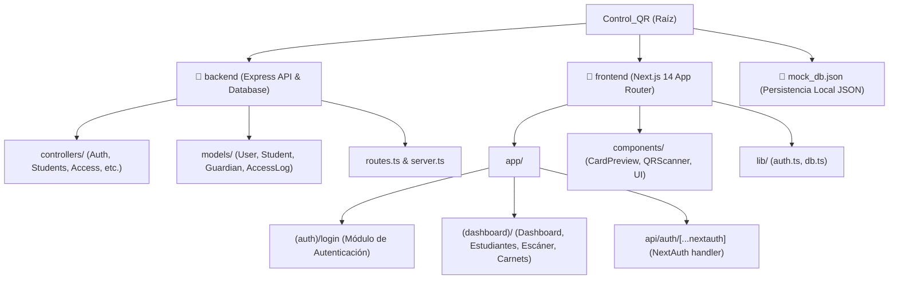
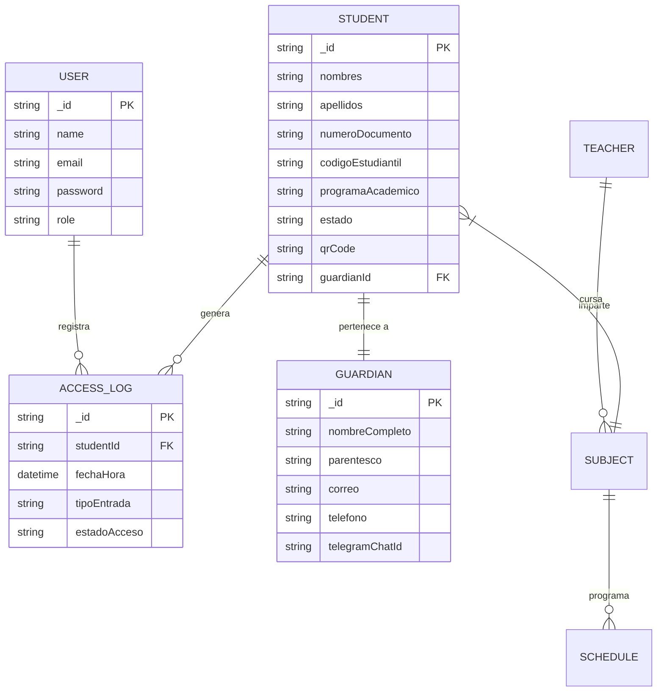
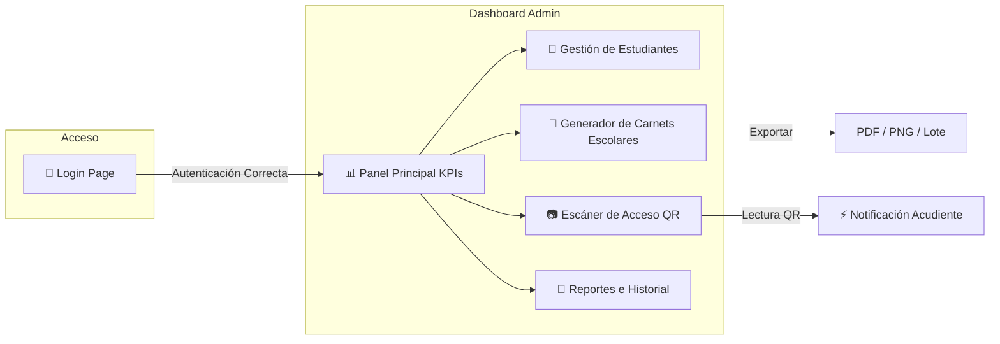

# ControlQR — Sistema de Control de Ingreso Estudiantil

**ControlQR** es una solución web integral diseñada para la gestión, emisión de carnets digitales y control de acceso en tiempo real de estudiantes en instituciones educativas y colegios.

---

## 📌 Resumen del Proyecto

El sistema automatiza el registro de ingresos de los estudiantes mediante la lectura de códigos QR dinámicos impresos o desplegados en carnets digitales. Incluye notificaciones a acudientes/guardianes (vía Telegram/Email), un panel administrativo de métricas (KPIs), gestión de matrículas, docentes y generación masiva o individual de carnets.

---

## 🎨 Paleta de Diseño y Estilo Visual

- **Estilo:** Moderno, académico y profesional (Dashboard Administrativo).
- **Colores Institucionales:** Paleta escolar basada en tonos verde (Emerald/Lime), amarillo institucional y blanco con acabados limpios.
- **Interfaz:** Responsive, bordes redondeados suavemente, sombreados sutiles, micro-animaciones y tarjetas interactivo-visuales.

---

## 🏗️ Estructura del Proyecto



---

## 🗄️ Esquema de Base de Datos (Modelo Entidad-Relación)



---

## 🖥️ Mapa de Interfaz y Navegación de Usuario



---

## 🚀 Arquitectura y Tecnologías

### Frontend & UI
- **Framework:** Next.js (App Router, React, TypeScript).
- **Estilos:** TailwindCSS (con variaciones dinámicas de verde institucional escolar).
- **Iconografía:** Lucide React.
- **Generación de Carnets y Exportación:** QRCode, `html-to-image`, `jspdf`.
- **Autenticación:** NextAuth.js (Gestión de sesiones seguras mediante credenciales de Administrador).

### Backend & Almacenamiento
- **Servidor:** Node.js + Express (TypeScript).
- **Base de Datos:** MongoDB con ODM Mongoose / Fallback de persistencia ligera JSON (`mock_db.json`).
- **Seguridad:** Encriptación de contraseñas con bcryptjs.

---

## 📂 Módulos y Funcionalidades Principales

### 1. Autenticación y Seguridad
- Iniciar / Cerrar sesión para el **Administrador** del sistema.
- Rutas privadas protegidas por NextAuth middleware.

### 2. Dashboard General (Métricas en Tiempo Real)
- Tarjetas de KPIs (Total estudiantes, accesos del día, ingresos a tiempo, retardos).
- Gráficos de flujo de ingresos y lista de actividad reciente.

### 3. Registro y Escáner de Acceso QR
- Lector de código QR en tiempo real desde la cámara web o escáner de mano.
- Verificación automática de estado del estudiante (Activo/Inactivo).
- Notificación automática instantánea a acudientes registrando fecha y hora exacta.

### 4. Generador de Carnet Digital Escolar
- Generación de carnet digital escolar.
- Código QR único integrado por estudiante.
- Panel de personalización en tiempo real (colores, logo, campos visibles).
- Exportación a **PNG, JPG y PDF**, con opción de generación en lote (masiva).

### 5. Gestión de Estudiantes y Acudientes (CRUD)
- Registro completo de estudiantes (Nombres, Documento, Código, Grado/Programa Escolar, Estado).
- Vinculación con Acudientes/Guardians y canales de contacto.

### 6. Gestión Académica (Docentes, Asignaturas y Horarios)
- Control de cursos/grados escolares, materias asignadas, docentes y horarios lectivos.

---

## 🗝️ Credenciales de Acceso por Defecto

- **Usuario:** `Administrador`
- **Contraseña:** `admin123`

---

## 🛠️ Ejecución Local

### 1. Iniciar el Frontend (Next.js)
```bash
cd frontend
npm run dev
```

### 2. Iniciar el Backend (Express)
```bash
cd backend
npm run dev
```
